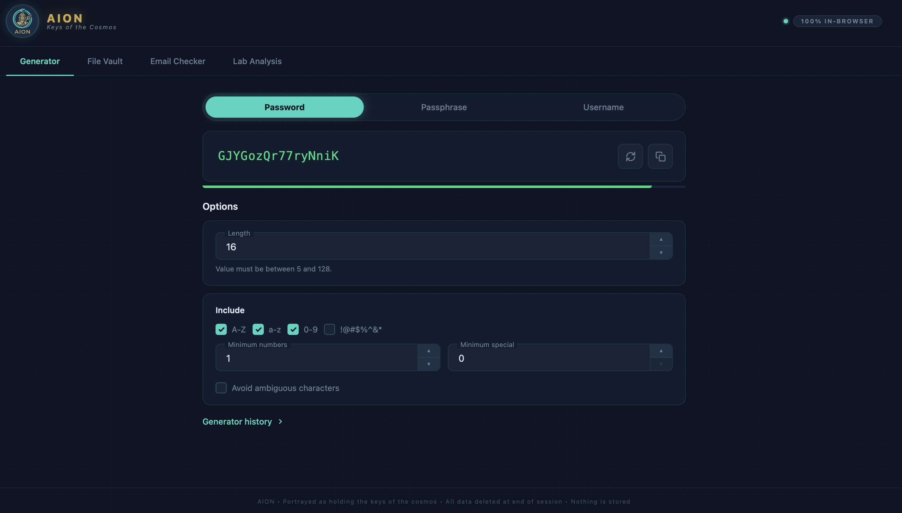
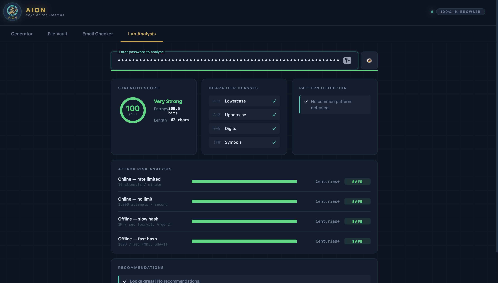
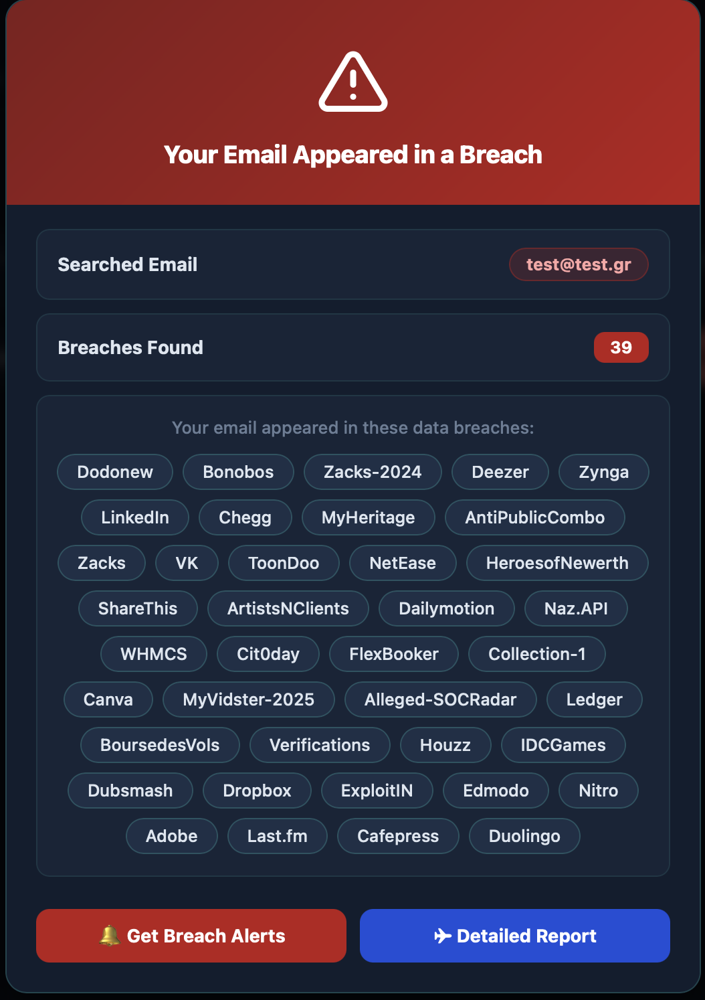
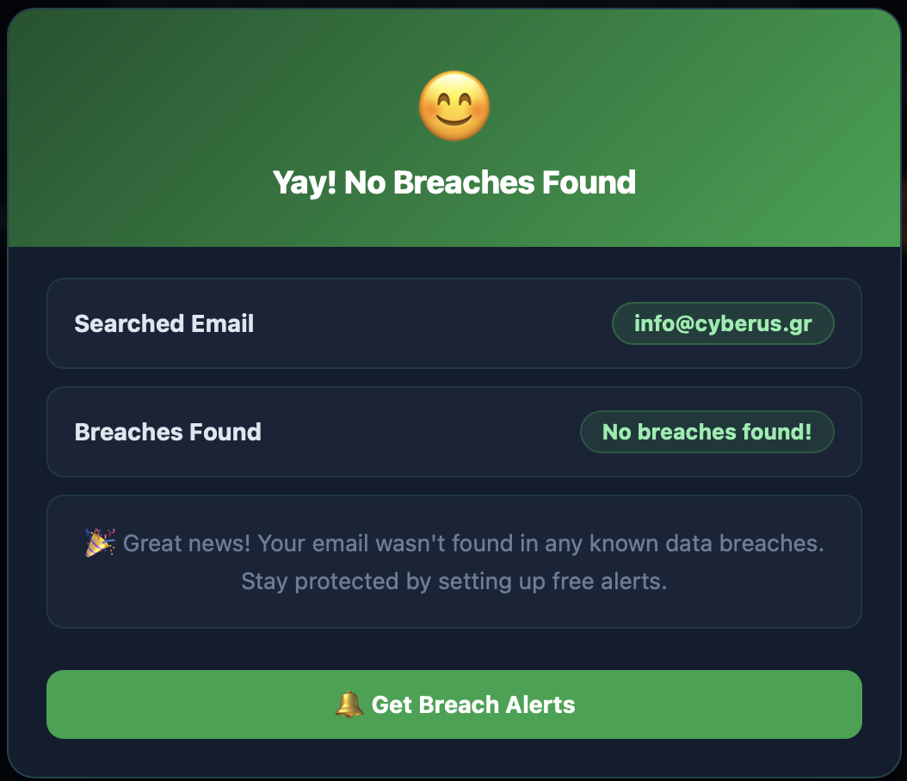

<p align="center">
  
</p>

<h1 align="center">AION</h1>
<p align="center">
  <strong>Password Analyzer · Smart Generator · Email Breach Checker</strong><br/>
  A free, open-source security toolkit — no account, no tracking, no server-side storage.
</p>

<p align="center">
  <a href="https://cyberus.gr/AION">🌐 Live Demo — cyberus.gr/AION</a>
  &nbsp;·&nbsp;
  <a href="https://github.com/cyberus-gr/AION">GitHub</a>
  &nbsp;·&nbsp;
  <a href="https://cyberus.gr">Cyberus</a>
</p>

---

## Overview

AION is a browser-based security toolkit built as a single-page web app with zero external dependencies. Everything runs client-side — passwords are never sent to any server. The Email Breach Checker queries the [XposedOrNot](https://xposedornot.com) public API directly from your browser.

---

## Screenshots

### Password Analyzer


### Smart Generator


### Lab Analysis


### Email Breach Checker



---

## Features

| Tab | What it does |
|---|---|
| **Password Analyzer** | Real-time strength scoring (0–100), entropy calculation, pattern detection (keyboard walks, sequences, leet-speak, dates), HIBP breach check, ranked fix suggestions |
| **Smart Generator** | Cryptographically secure random passwords, Diceware-style passphrases, PINs — configurable length, charset, and policy rules |
| **Lab Analysis** | Side-by-side password comparison, bulk batch analysis, strength distribution charts |
| **Email Checker** | Checks your email against the XposedOrNot breach database, shows affected services with a full popup report |

---

## Live App

**https://cyberus.gr/AION**

No install. Open in any modern browser.

---

## Run Locally

```bash
git clone https://github.com/cyberus-gr/AION.git
cd AION
python web/server.py 8080
# Open http://localhost:8080
```

> The local server is only needed to satisfy browser CORS policy for `file://` URLs.
> The deployed version on cyberus.gr runs without any backend.

---

## Security & Privacy

- **Passwords never leave your browser.** All analysis and generation is done in client-side JavaScript.
- **HIBP check uses k-anonymity.** Only the first 5 characters of the SHA-1 hash are sent — your password is never transmitted.
- **Email breach check is read-only.** Queries the XposedOrNot public API with no authentication or tracking.
- **No cookies. No analytics. No accounts.**

---

## CLI Tool

AION also ships a standalone Python CLI for terminal use:

```bash
pip install rich        # optional, for polished output
python main.py --help

# Analyze
python main.py analyze "MyP@ssword123"
python main.py analyze --check-hibp "MyP@ssword123"

# Generate
python main.py generate
python main.py generate --mode passphrase --words 6
python main.py generate --mode pin --length 8
```

---

## Project Structure

```
├── web/
│   ├── index.html          # Single-page web app
│   ├── style.css           # UI styles
│   ├── aion-logo.png       # Logo
│   └── js/
│       ├── app.js          # Password analyzer + generator UI
│       └── emailchecker.js # Email breach checker (XposedOrNot API)
├── main.py                 # Python CLI entry point
├── analyzer/               # Scoring pipeline (entropy, patterns, dict)
├── generator/              # Password / passphrase / PIN generators
├── display/                # CLI renderers (plain + rich)
├── data/                   # Common passwords blocklist + wordlist
└── tests/                  # 64 unit tests
```

---

## Tech Stack

- **Frontend:** Vanilla HTML5 · CSS3 · JavaScript (ES2020) — no frameworks, no build step
- **Email API:** [XposedOrNot](https://xposedornot.com/api_doc) public API (free, no key required)
- **CLI Backend:** Python 3.8+ standard library only (`secrets`, `zlib`, `hashlib`, `getpass`)
- **Hosting:** GitHub Pages via GitHub Actions

---

## Deployment

AION auto-deploys to GitHub Pages on every push to `main` via the workflow at [.github/workflows/deploy.yml](.github/workflows/deploy.yml).

---

## Part of Cyberus

AION is an open-source project by [Cyberus](https://cyberus.gr) — an independent security research initiative.